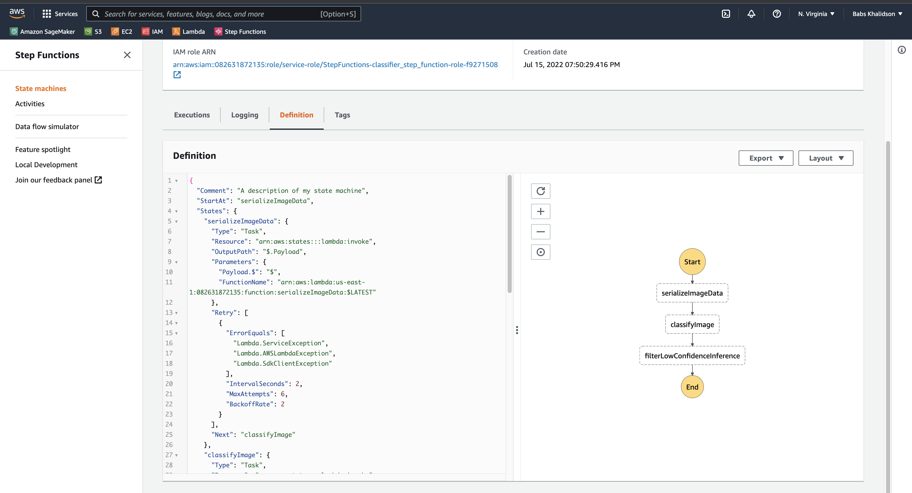
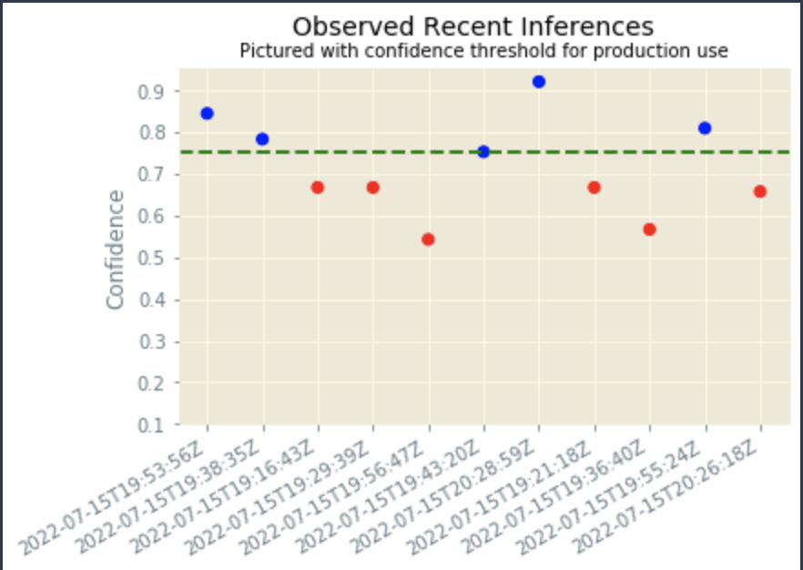

# First ML Workflow

Here we classify an image whether it is a bicycle or motorcycle.

## Overview
In this project we create a general ML workflow on AWS.

We learn how to create Endpoints, use Lambda and Step Functions. And finally we learn how to monitor ML workflow with Model Monitor.

## Lambda Functions
All lambda functions are located in [lambda_functions/](lambda_functions/)

## Step Function
Step Function's JSON Definition is located in [step_functions/](step_function/)

Screenshot of step function: 

## Visualization
The image below demonstrates the resulting inferences using Model Monitor:

### Scatter plot:

